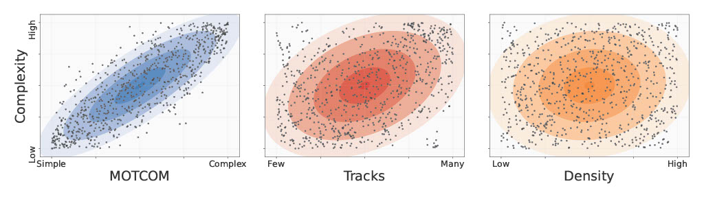

# MOTCOM: The Multi-Object Tracking Dataset Complexity Metric
This repository is the official PyTorch implementation of MOTCOM: The Multi-Object Tracking Dataset Complexity Metric presented at ECCV 2022.

The code enables calculation of the MOTCOM sub-metrics for the MOTChallenge datasets:

- OCOM (Occlusion metric)
- MCOM (Movement metric)
- VCOM (Visual Appearance metric)


Useful links: <br>
[[Project page]](https://vap.aau.dk/motcom/)<br>



## Abstract
There exists no comprehensive metric for describing the complexity of Multi-Object Tracking (MOT) sequences. This lack of metrics decreases explainability, complicates comparison of datasets, and reduces the conversation on tracker performance to a matter of leader board position. As a remedy, we present the novel MOT dataset complexity metric (MOTCOM), which is a combination of three sub-metrics inspired by key problems in MOT: occlusion, erratic motion, and visual similarity. The insights of MOTCOM can open nuanced discussions on tracker performance and may lead to a wider acknowledgement of novel contributions developed for either less known datasets or those aimed at solving sub-problems. 
We evaluate MOTCOM on the comprehensive MOT17, MOT20, and MOTSynth datasets and show that MOTCOM is far better at describing the complexity of MOT sequences compared to the conventional density and number of tracks.

## Requirements

Code was tested in virtual environment with Python 3.8. Install requirements as in the requirements.txt file.


## Data Preparation

From the TrackEval repository you can download the groundtruth data from the train splits of some of the most widely used MOT benchmark datasets: [data.zip](https://omnomnom.vision.rwth-aachen.de/data/TrackEval/data.zip).
Download and extract the data.zip file and place it in the root folder of this repository.
Only the *data/gt/mot_challenge* subfolder is required to run the examples provided below.
Next, download the MOT16 sequences from the [MOTChallenge website]([https://motchallenge.net/](https://motchallenge.net/data/MOT16.zip)).
Extract the sequences and place it the *images* folder such that you get a structure that looks like this: *images/MOT16/train*

## How to calculate MOTCOM sub-metrics

This snippet will walkthrough how the MOTCOM sub-metrics can be computed, assuming the data has been placed as described earlier.

### Extracting VCOM Features

First the features for the VCOM metric has to be extracted. This is achieved by running the `trackeval/extract_vcom_features.py` script. 

For the MOT16 dataset with a ResNet18 extractor network:
```bash
python ./trackeval/extract_vcom_features.py --BENCHMARK MOT16 --EXTRACTOR RESNET18 
```

By default the extracted features are saved in ./VCOM_Features/BENCHMARK/Seq/features. The features are saved in separate .pkl files for each identity.

The `trackeval/extract_vcom_features.py` have the following arguments to control the feature extraction process:
- `BENCHMARK` - Which benchmark to evaluate.
- `IMAGES_FOLDER` - Path to the BENCHMARK images.
- `FEATURES_FOLDER` - Path to the extracted VCOM features.
- `WEIGHTS_FOLDER` - Path to where the pretrained network weights will be saved.
- `EXTRACTOR` - Pre-trained feature extractor ResNet.
- `NUM_WORKERS_TORCH` - Number of workers used in the PyTorch Dataloader.
- `BATCH_SIZE` - Batch size used in the PyTorch Dataloader.
- `BLUR_SIZE` - The width of the Gaussian Blur kernel.
- `BLUR_SIGMA` - The standard deviation of the Gaussian Blur kernel


### Calculating MOTCOM sub-metrics

With the VCOM features extracted, the three MOTCOM sub-metrics can be computed.
This is achieved by running the `scripts/run_mot_motcom.py` script.

For the MOT16 dataset:

```bash
python ./scripts/run_mot_motcom.py --BENCHMARK MOT16 --EXTRACTOR RESNET18 --METRICS OCOM MCOM VCOM --USE_PARALLEL True
```

The output is by default saved into *data/MOTCOM/mot_challenge/BENCHMARK-SPLIT_TO_EVAL/*.

- `USE_PARALLEL` - Whether to parallelize the metric calculations.
- `GT_FOLDER` - Path to the BENCHMARK gt files.
- `OUTPUT_FOLDER` - Path to the computed metrics.
- `BENCHMARK` - Which benchmark to evaluate.
- `SPLIT_TO_EVAL` - Which split of the dataset to evaluate.
- `METRICS` - Which metrics to compute.
- `FEATURES_FOLDER` - Path to the extracted VCOM features.
- `EXTRACTOR` - Pre-trained feature extractor ResNet.
- `BBOX_BASED_OCC` - Whether to use bounding box intersections for estimating OCOM.
- `Y_COORD_OCC` - Whether to use the y-coordinate to infer order of objects when calculating OCOM using bounding boxes. Only used with BBOX_BASED_OCC, and not suitable for aerial or underwater movement. 


The final MOTCOM value for a sequence is obtained by calculating the mean of its OCOM, MCOM, and VCOM values.

# License

Licensed under a MIT License, as per the [TrackEval repository](https://github.com/JonathonLuiten/TrackEval), which this repository was based on.


# Citation
```bibtex
@InProceedings{Pedersen_ECCV_2022,
    author    = {Pedersen, Malte and Haurum, Joakim Bruslund and Dendorfer, Patrick and Moeslund, Thomas B.},
    title     = {{MOTCOM}: The Multi-Object Tracking Dataset Complexity Metric},
    booktitle = {Computer Vision -- ECCV 2022},
    month     = {October},
    year      = {2022}
}
```
